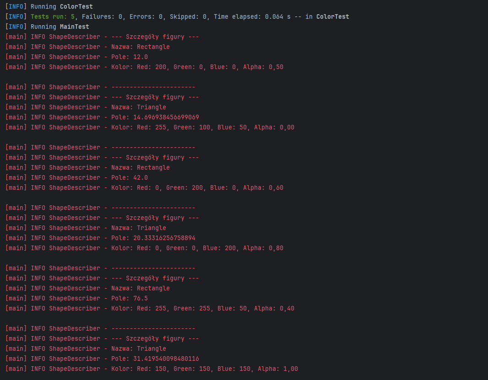

Rysowanie figury:
Typ figury: Rectangle
Kolor figury: Red: 200, Green: 0, Blue: 0, Alpha: 0,50

Reprezentacja graficzna:
* * * 
* * * 
* * * 
* * * 

Rysowanie figury:
Typ figury: Triangle
Kolor figury: Red: 255, Green: 100, Blue: 50, Alpha: 0,00

Reprezentacja graficzna:
* *
  * * * * 
 * * * * * 
* * * * * * * 

Rysowanie figury:
Typ figury: Rectangle
Kolor figury: Red: 0, Green: 200, Blue: 0, Alpha: 0,60

Reprezentacja graficzna:
* * * * * * 
* * * * * * 
* * * * * * 
* * * * * * 
* * * * * * 
* * * * * * 
* * * * * * 

Rysowanie figury:
Typ figury: Triangle
Kolor figury: Red: 0, Green: 0, Blue: 200, Alpha: 0,80

Reprezentacja graficzna:
* *
   * * * 
  * * * * * 
 * * * * * * 
* * * * * * * * 

Rysowanie figury:
Typ figury: Rectangle
Kolor figury: Red: 255, Green: 255, Blue: 50, Alpha: 0,40

Reprezentacja graficzna:
* * * * * * * * 
* * * * * * * * 
* * * * * * * * 
* * * * * * * * 
* * * * * * * * 
* * * * * * * * 
* * * * * * * * 
* * * * * * * * 
* * * * * * * * 

Rysowanie figury:
Typ figury: Triangle
Kolor figury: Red: 150, Green: 150, Blue: 150, Alpha: 1,00

Reprezentacja graficzna:
* *
* * * *
   * * * * * * 
  * * * * * * * 
 * * * * * * * * * 
* * * * * * * * * * * 

[INFO] Tests run: 1, Failures: 0, Errors: 0, Skipped: 0, Time elapsed: 0.045 s -- in MainTest
[INFO] Running ShapeRendererTest
Rysowanie figury:
Typ figury: Triangle
Kolor figury: Red: 255, Green: 255, Blue: 0, Alpha: 0,00

Reprezentacja graficzna:
 * * * 
* * * * * 

Rysowanie figury:
Typ figury: Triangle
Kolor figury: Red: 255, Green: 0, Blue: 255, Alpha: 0,00

Reprezentacja graficzna:
 * * * 
* * * * * 

Rysowanie figury:
Typ figury: Rectangle
Kolor figury: Red: 255, Green: 0, Blue: 0, Alpha: 0,00

Reprezentacja graficzna:
* *
* *
* *

[INFO] Tests run: 3, Failures: 0, Errors: 0, Skipped: 0, Time elapsed: 0.009 s -- in ShapeRendererTest
[INFO] Running ShapeTest
[INFO] Tests run: 1, Failures: 0, Errors: 0, Skipped: 0, Time elapsed: 0.002 s -- in ShapeTest
[INFO] Running TriangleTest
[INFO] Tests run: 6, Failures: 0, Errors: 0, Skipped: 0, Time elapsed: 0.011 s -- in TriangleTest
[INFO]
[INFO] Results:
[INFO]
[INFO] Tests run: 16, Failures: 0, Errors: 0, Skipped: 0
[INFO]
[INFO]
[INFO] --- jacoco:0.8.11:report (default-cli) @ untitled ---
[INFO] Loading execution data file C:\Users\dg\IdeaProjects\untitled\target\jacoco.exec
[INFO] Analyzed bundle 'untitled' with 7 classes
[INFO] ------------------------------------------------------------------------
[INFO] BUILD SUCCESS
[INFO] ------------------------------------------------------------------------
[INFO] Total time:  2.616 s
[INFO] Finished at: 2024-11-24T12:43:18+01:00
[INFO] ------------------------------------------------------------------------

<table class="coverage" cellspacing="0" id="coveragetable">
  <thead>
    <tr>
      <td class="sortable" id="a" onclick="toggleSort(this)">Element</td>
      <td class="down sortable bar" id="b" onclick="toggleSort(this)">Missed Instructions</td>
      <td class="sortable ctr2" id="c" onclick="toggleSort(this)">Cov.</td>
      <td class="sortable bar" id="d" onclick="toggleSort(this)">Missed Branches</td>
      <td class="sortable ctr2" id="e" onclick="toggleSort(this)">Cov.</td>
      <td class="sortable ctr1" id="f" onclick="toggleSort(this)">Missed</td>
      <td class="sortable ctr2" id="g" onclick="toggleSort(this)">Cxty</td>
      <td class="sortable ctr1" id="h" onclick="toggleSort(this)">Missed</td>
      <td class="sortable ctr2" id="i" onclick="toggleSort(this)">Lines</td>
      <td class="sortable ctr1" id="j" onclick="toggleSort(this)">Missed</td>
      <td class="sortable ctr2" id="k" onclick="toggleSort(this)">Methods</td>
      <td class="sortable ctr1" id="l" onclick="toggleSort(this)">Missed</td>
      <td class="sortable ctr2" id="m" onclick="toggleSort(this)">Classes</td>
    </tr>
  </thead>
  <tfoot>
    <tr>
      <td>Total</td>
      <td class="bar">11 of 507</td>
      <td class="ctr2">97%</td>
      <td class="bar">5 of 28</td>
      <td class="ctr2">82%</td>
      <td class="ctr1">7</td>
      <td class="ctr2">38</td>
      <td class="ctr1">2</td>
      <td class="ctr2">87</td>
      <td class="ctr1">2</td>
      <td class="ctr2">24</td>
      <td class="ctr1">0</td>
      <td class="ctr2">7</td>
    </tr>
  </tfoot>
  <tbody>
    <tr>
      <td id="a0">
        <a href="default/index.html" class="el_package">default</a>
      </td>
      <td class="bar" id="b0">
        
        
      </td>
      <td class="ctr2" id="c0">97%</td>
      <td class="bar" id="d0">
        
        
      </td>
      <td class="ctr2" id="e0">82%</td>
      <td class="ctr1" id="f0">7</td>
      <td class="ctr2" id="g0">38</td>
      <td class="ctr1" id="h0">2</td>
      <td class="ctr2" id="i0">87</td>
      <td class="ctr1" id="j0">2</td>
      <td class="ctr2" id="k0">24</td>
      <td class="ctr1" id="l0">0</td>
      <td class="ctr2" id="m0">7</td>
    </tr>
  </tbody>
</table>
